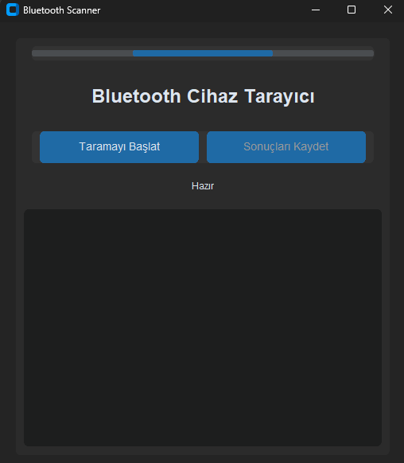

# 🔍 Bluetooth Scanner

Modern ve kullanıcı dostu bir Bluetooth cihaz tarama uygulaması. CustomTkinter ile tasarlanmış şık bir arayüz ve kapsamlı cihaz bilgisi toplama özelliği sunar.



## ✨ Özellikler

- 🎯 Modern ve koyu temalı kullanıcı arayüzü
- 🔄 Gerçek zamanlı Bluetooth cihaz taraması
- 📊 Kapsamlı cihaz bilgileri:
  - Cihaz adı ve adresi
  - Sinyal gücü (RSSI)
  - Yerel isim
  - Üretici verileri
  - Servis bilgileri
  - TX gücü
- 💾 Otomatik veri kaydetme:
  - CSV formatında yapılandırılmış veri
  - TXT formatında detaylı rapor
- 🎨 Kullanıcı dostu arayüz:
  - İlerleme çubuğu
  - Durum bildirimleri
  - Merkezi konumlandırılmış kontroller

## 🚀 Başlangıç

### Gereksinimler

- Python 3.8 veya üzeri
- pip (Python paket yöneticisi)

### Kurulum

1. Projeyi klonlayın:
```bash
git clone https://github.com/faust-lvii/Bluetooth-Scanner
cd Bluetooth-Scanner
```

2. Gerekli paketleri yükleyin:
```bash
pip install -r requirements.txt
```

### Kullanım

1. Uygulamayı başlatın:
```bash
python bluetooth_scanner.py
```

2. "Taramayı Başlat" butonuna tıklayarak Bluetooth taramasını başlatın
3. Tarama tamamlandığında "Sonuçları Kaydet" butonu ile verileri kaydedin
4. Kaydedilen dosyaları `bluetooth_scans` klasöründe bulabilirsiniz

## 📁 Proje Yapısı

```
Bluetooth-Scanner/
├── bluetooth_scanner.py    # Ana uygulama dosyası
├── requirements.txt        # Bağımlılıklar
├── bluetooth_scans/        # Kaydedilen tarama sonuçları
│   ├── *.csv              # CSV formatında veriler
│   └── *.txt              # TXT formatında raporlar
└── README.md              # Proje dokümantasyonu
```

## 🛠️ Teknik Detaylar

- **CustomTkinter**: Modern ve özelleştirilebilir GUI bileşenleri
- **Bleak**: Güçlü Bluetooth Low Energy (BLE) tarama kütüphanesi
- **Asyncio**: Asenkron işlemler için Python kütüphanesi
- **Threading**: Çoklu iş parçacığı desteği

## 📊 Veri Formatları

### CSV Formatı
Kaydedilen CSV dosyaları aşağıdaki alanları içerir:
- İsim
- Adres
- RSSI
- Yerel İsim
- Üretici Verileri
- Servis Verileri
- Servis UUIDleri
- TX Gücü

### TXT Formatı
TXT dosyaları, tarama sırasında görüntülenen tüm bilgileri formatlanmış şekilde içerir.

## 🤝 Katkıda Bulunma

1. Bu projeyi fork edin
2. Yeni bir branch oluşturun (`git checkout -b feature/amazing-feature`)
3. Değişikliklerinizi commit edin (`git commit -m 'Add some amazing feature'`)
4. Branch'inizi push edin (`git push origin feature/amazing-feature`)
5. Bir Pull Request oluşturun

## 📝 Lisans

Bu proje MIT lisansı altında lisanslanmıştır. Detaylar için [LICENSE](LICENSE) dosyasına bakın.

## 👤 Yazar

**Faust LVII**
- GitHub: [@faust-lvii](https://github.com/faust-lvii)

## 🌟 Teşekkürler

- CustomTkinter ekibine modern GUI bileşenleri için
- Bleak geliştiricilerine güçlü Bluetooth desteği için
- Tüm katkıda bulunanlara ve kullanıcılara